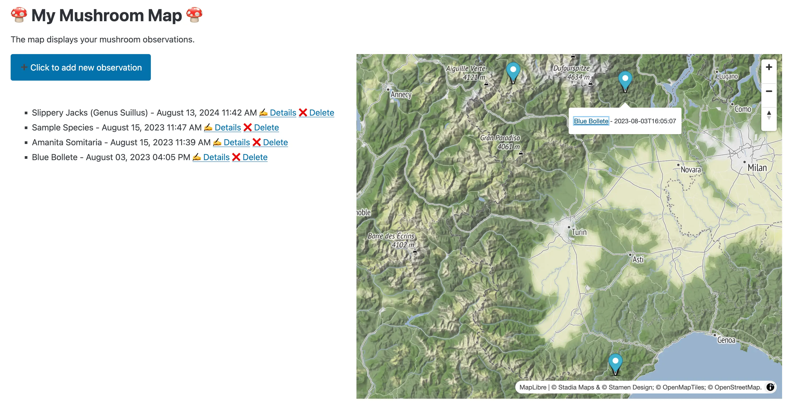
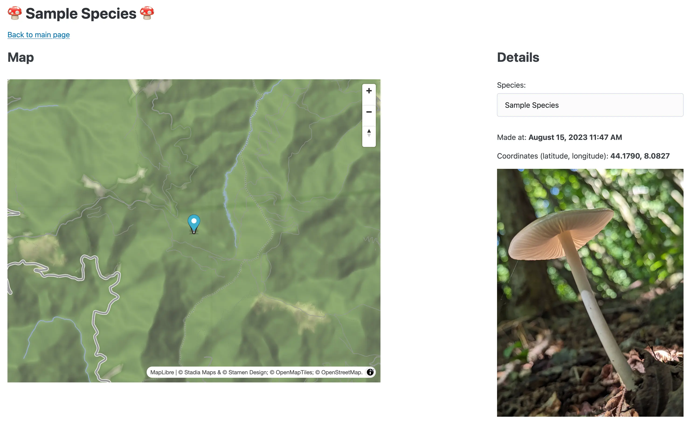

# fasthtml-fungi-2 - My Mushroom Map

## Description

This application allows users to upload photos of mushrooms they have found. Upon uploading, the app will automatically extract the GPS coordinates from the EXIF data embedded in the photos. Using these coordinates, the app will then display a map highlighting the locations of all the mushroom observations. This feature enables users to easily visualize where different types of mushrooms have been found.

*Sample overview map*

*Sample of a mushroom observation page*

## Installation

* Clone this git repository, e.g. using `git clone --depth 1 https://github.com/velaia/fasthtml_fungi_2`.

NB: The installation with uv is way faster.

### Using [uv](https://github.com/astral-sh/uv)

* Make sure to [have uv installed](https://github.com/astral-sh/uv) (`uv` is pip on steroids (and more)!)
* `cd fasthtml_fungi_2` into the cloned repository
* `uv sync`
* Active the newly created virtualenv (e.g. `source .venv/bin/activate`)
* Run the program with `uv run fasthtml-fungi-2` and open the [displayed URL](http://localhost:5001) in your browser to add your first mushroom observation

### Using pip

* `cd fasthtml_fungi_2` into the cloned repository
* `python -m venv .venv && source .venv/bin/activate` to create a virtual environment and activate it
* `pip install -r requirements.txt && pip install -e ./` to install the dependencies
* `python src/fasthtml_fungi_2/__init__.py` to run the program, then open the [displayed URL](http://localhost:5001) in your browser to add your first mushroom observation

### Using Docker

## Configuration
You can adjust settings in the `.env` file, e.g. [choose a different Stadia Maps theme](https://docs.stadiamaps.com/themes/).

## Technology

This is a pet project of mine to explore a couple of tools I've been wanting to explore for a while in combination with my interest in 🍄 mushrooms 🍄.
* [Answer.ai's FastHTML](https://fastht.ml/)
* [Rye/Astral uv: a Hassle-Free Python Experience](https://rye.astral.sh/)
* [GitHub Copilot](https://github.com/features/copilot)
* [🍦icecream](https://github.com/gruns/icecream) & [dotenv](https://github.com/theskumar/python-dotenv)
* [🗺 Stadia Maps](https://www.stadiamaps.com)

## TODOs
* [ ] Dockerfile & instructions
* [ ] Add Observations section (issues with new tools, libraries that might be solved in tools that have been around for a while and where an ecosystem exists (e.g. page templates, footer, header, paginated tables, ...); advantages of rye/uv)
* [ ] ~~Test rye build; how could it be used to distribute the app through PyPI as standalone app?~~
* [x] switch to uv from rye ([see blog post](https://lucumr.pocoo.org/2024/8/21/harvest-season/))
* [ ] ~~Add footer (to all pages!)~~
* [ ] ~~Add version increment to project (e.g. [python-versioneer](https://github.com/python-versioneer/python-versioneer) or [bump-my-version](https://github.com/callowayproject/bump-my-version))~~
* [ ] ~~New observation in modal [DialogX](https://docs.fastht.ml/api/xtend.html#dialogx)~~
* [x] Motivation
* [x] pip installation instructions
* [x] What (else) to put in dotfile? Clean up uploads directory config.
* [x] ~~Create demo online using railway.app~~ Map display works on localhost with free plan + user management not included
* [x] Include screenshot or short video of the app
* [x] Add LICENSE
* [x] Complete pyproject.toml with relevant meta data
* [x] Investigate issue with toasts [and session](https://github.com/AnswerDotAI/fasthtml/issues/247); [new issue created](https://github.com/AnswerDotAI/fasthtml/issues/297)
